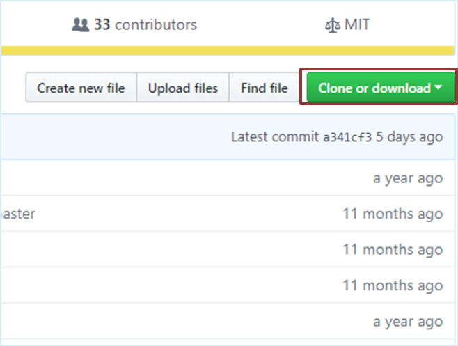
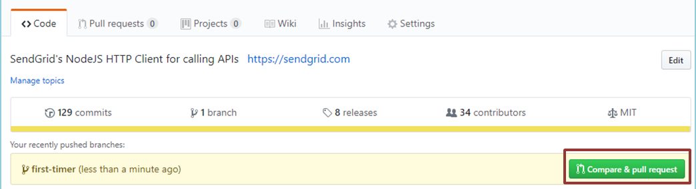
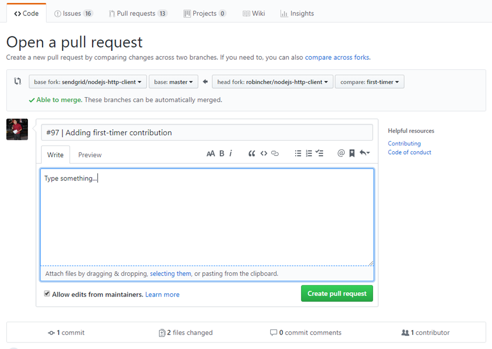

# First-timer contribution for smtpapi-nodejs

It's always difficult the first time you do something. Especially when you are collaborating, making mistakes isn't a comfortable thing. We wanted to simplify the way new contributors learn & contribute to Sendgrid library for the first time.

This documentation aims to guide you on how to make your first contribution.

## Getting ready

If you don't have git on your machine, [install it]( https://help.github.com/articles/set-up-git/).

If you don't have a Github's account yet, register your [account here](https://github.com/join).

Assuming you are all set-up, you are now ready to proceed to make your first contribution.

## Finding a suitable task

In our library,  issues are labeled according to their difficulty. You can pick any of them based on your comfort level.

For a first-timer, we recommend you to try the easy ones [here](https://github.com/sendgrid/smtpapi-nodejs/issues?q=is%3Aopen+label%3A%22difficulty%3A+easy%22+label%3A%22status%3A+help+wanted%22) for a gentle start in contributing.

Up for more challenges ? Try these instead:
- [Medium labeled issues](https://github.com/sendgrid/smtpapi-nodejs/issues?q=is%3Aopen+is%3Aissue+label%3A%22difficulty%3A+medium%22)
- [Hard labeled issues](https://github.com/sendgrid/smtpapi-nodejs/issues?q=is%3Aopen+is%3Aissue+label%3A%22difficulty%3A+hard%22)


## Fork this repository

Fork this repository by clicking on the fork button on the top of this page. This will create a copy of this repository into your Github's account.

## Clone the repository



You can now clone the forked repository to your local  machine. Go to your GitHub account, open the forked repository, click on the clone button and then click the *copy to clipboard* icon.

Open a terminal or command prompt , and run the following git command

```bash
git clone "URL copied to clipboard"
```

For example :

```bash
git clone https://github.com/yourself/smtpapi-nodejs.git
```

**yourself** is your GitHub username. What this command do is to copy the contents of smtpapi-nodejs in Github to your local machine.

## Create a branch

Change to the newly cloned directory

```bash
cd smtpapi-nodejs
```

Assign the original repository remote as upstream

```bash
git remote add upstream https://github.com/sendgrid/smtpapi-nodejs
```

Now create a topic branch

```bash
git checkout -b <new-branch-name>
```

For example:

```bash
git checkout -b first-contribution
```

## Make your changes
### Development Environment ###

The following lines of instructions will help you set up the repository on your local system, which will help you to view and test your changes. 

#### Install and Run Locally ####

- ##### Prerequisites #####

- Node.js version 0.10, 0.12, 4 or better.

    To check whether you have the required version, open your command line and run
    ```bash
    node --version
    ```
    If it outputs something like
    ```bash
    bash: node: command not found
    ```
    That means you will have to install Node.js. The preferred source is [here](https://nodejs.org/en/).
    This will also install [npm](https://www.npmjs.com/) on your local system.

- The SendGrid Service, starting at the [free level](https://sendgrid.com/free?source=smtpapi-nodejs).
- Please see [package.json](https://github.com/sendgrid/smtpapi-nodejs/blob/master/package.json). If you are unfamiliar with this, check this [documentation](https://docs.npmjs.com/files/package.json).

- ##### Initial setup: #####

Running the following command will install all the dependencies which are required to run this repository on your local system. For more info, check [this](https://docs.npmjs.com/cli/install) out.

```bash
npm install
```

## Environment Variables

First, get your free SendGrid account [here](https://sendgrid.com/free?source=smtpapi-nodejs). Then run these commands to integrate your account on your local system, using [Environment Variables](https://en.wikipedia.org/wiki/Environment_variable).

```bash
echo "export SENDGRID_USERNAME='YOUR_USERNAME'" > sendgrid.env
echo "export SENDGRID_PASSWORD='YOUR_PASSWORD'" >> sendgrid.env
echo "sendgrid.env" >> .gitignore
source ./sendgrid.env
```

### Execute: ###

Finally it is the time to run it on your local system! 
See the [examples folder](https://github.com/sendgrid/smtpapi-nodejs/tree/master/examples) to get started quickly.

To run the example (after updating the settings and the emails):

```bash
node examples/example.js
```

### Verifying your changes

After making your changes, you can run the following git command:

```bash
git status
```

This will tell you which files are modified or added. 

In case you had unknowingly modified the wrong files, you can run ```git checkout wrong-modified.file``` to revert the changes.

### Testing
Create test cases whenever there are new features being added to the codebase.

Additionally, ensure all local unit test are passing before commiting the changes.

All Pull Requests require passing tests before the PR will be reviewed.

All test files are in the [`test`](https://github.com/sendgrid/smtpapi-nodejs/tree/master/test) directory.

For the purposes of contributing to this repo, please update the [`main.js`](https://github.com/sendgrid/smtpapi-nodejs/blob/master/test/main.js) file with unit tests as you modify the code.


```bash
# Running local unit test

npm test
```

To know more about what are unit tests, check [this](https://stackoverflow.com/questions/1383/what-is-unit-testing) out. Also, Read [this](https://softwareengineering.stackexchange.com/questions/21133/how-to-write-good-unit-tests) if you want to know about how to write good tests.

### Documentation
Documentation are an essential part of any open-source library. 
Add or update example code to demonstrate the code changes. This will help people to use your contributions in the future.

For more info, check [here](USAGE.md).

### Style Guidelines & Naming Conventions

Generally, we follow the style guidelines as suggested by the official language. However, we ask that you conform to the styles that already exist in the library. If you wish to deviate, please explain your reasoning.

- [Unofficial Style Guide](https://github.com/felixge/node-style-guide)

Please run your code through:

- [ESLint](http://eslint.org/) with the standard style guide.
- [esdoc](https://github.com/sendgrid/smtpapi-nodejs/blob/master/.github/USAGE.md) to check the documentation coverage of your added code.

### Commiting 
Commit your changes in logical chunks and give meaningful commit messages. If required, please refer to [git commit message guidelines](http://tbaggery.com/2008/04/19/a-note-about-git-commit-messages.html)

Additionally, you can reference the commits to an Github's issue. This will creates an association between the pull request and issue, and will close the issue as soon as the pull request is merged.

For example : 

```bash
git commit -m "#86 | Update dev dependency"
```

## Incorporating upstream changes

Before you push , you have to incorporate potential new changes from the original repository.

**Option A** : Locally rebase the upstream master. Remember we have previously assigned upstream as the original repository location.

```bash
git pull --rebase upstream master
```

**Option B** : You can also fetch, observe the difference , before merging. Git fetch allow you to review commits before safely integrating them.

```bash
# Fetch the upstream commits
git fetch upstream master

# Observe the differences between local branch and original repository master
git diff <new-branch-name> upstream/master

# Merge original master commits to local branch
git merge upstream/master 
```

## Pushing your changes
If you go to your repository on GitHub, you'll see a Compare & pull request button. Click on the button, and now you can submit a pull request.

## Submit your changes for review

If you go to your repository on GitHub, you'll see a Compare & Pull request button. Click on it.




Ensure the base fork is set to sendgrid/smtpapi-nodejs, and select your topic branch where the changes are made.



You can now submit the pull request.

## Next steps
Congrats! You just completed the standard fork -> clone -> edit -> Pull request workflow that an open-source contributor usually encountered.

Now let's get your started with contributing to other [Sendgrid's projects](https://github.com/sendgrid).

If you have any additional questions, please feel free to [email](mailto:dx@sendgrid.com) us or create an issue in this repository.